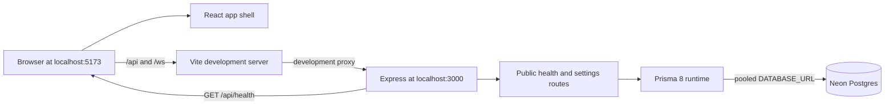

# Architecture

How the app is put together, as built. For what it should do, see [README.md](../README.md).

Last updated: 2026-09-30

## Current state

Step 2 adds the complete database contract, migration package, seed command and public database reads (README §4 and §11). The generated migration is ready but has not been applied to Neon because the required direct connection and owner seed values are not configured locally.

- `frontend/` is a React single-page app with a four-tab user shell, route placeholders and shared components. `frontend/src/design.css` is the only app stylesheet.
- `backend/` is an Express server listening on `PORT` or 3000. HTTP routes are mounted at `/api`; process health, database health and public call settings are implemented.
- `backend/src/prisma/contract.prisma` defines the 13 application tables. The running app and seed use the pooled `DATABASE_URL`; Prisma migration commands use `DIRECT_DATABASE_URL`.
- Prisma 8 timestamps use native PostgreSQL `timestamptz`, `date` and `time` columns. A Temporal polyfill supplies the required runtime types on Node.js 24.
- Vite forwards `/api` and `/ws` to the backend in development so the browser uses one origin.
- The existing WebSocket stubs remain unchanged until Step 10.

## Overview



Production hosting is not built yet. README §1 requires the frontend, API and WebSocket endpoint to use one HTTPS domain.

## Folder structure

```text
backend/
  index.ts                  Express setup, health route and server listener
  routes/Public.ts          Public database health and settings handlers
  routes/                   Other mounted route modules; handlers come in later steps
  src/prisma/               Contract, generated artifacts, runtime client and seed
  migrations/               Prisma 8 migration graph, snapshots and compiled operations
  src/realtime/             Existing stubs reserved for Step 10
frontend/
  src/App.tsx               Route map, placeholders and user app shell
  src/components/           Shared UI components
  src/screens/DesignPage.tsx Development-only component and motion gallery
  src/design.css             Tokens, base styles, components and animation
  src/main.tsx               Fonts, global CSS, router and React root
  vite.config.ts             Development proxy for /api and /ws
docs/
  features/                 Per-step implementation records
```

## Key libraries

| Library | Used for | Added in step |
|---|---|---|
| React 19 and React DOM | Frontend component rendering | Boilerplate |
| Vite 8 | Frontend development server and production bundling | Boilerplate |
| React Router | Client-side routes and active bottom tabs | 1 |
| `@fontsource/nunito` | Self-hosted Nunito font files | 1 |
| Express 5 | Backend HTTP server and routers | Boilerplate |
| `cors` | Credentialed allow-origin response headers | Boilerplate; moved to runtime dependencies in 1 |
| `dotenv` | Load backend environment variables | Boilerplate; applied at server entry in 1 |
| `tsx` | Watch and run backend TypeScript in development | 1 |
| TypeScript | Backend type-checking and frontend compilation | Direct backend dependency added in 1 |
| Vitest | Backend tests, including seed validation and hash checks | 1 |
| Prisma 8 packages | Contract emission, migration tooling and PostgreSQL runtime | Boilerplate; upgraded and completed in 2 |
| `argon2` | Argon2id hash for the seeded owner password | 2 |
| `temporal-polyfill` | Temporal values for Prisma 8 on Node.js 24 | 2 |
| `ws` | Existing WebSocket stubs | Boilerplate; implementation is Step 10 |

## External services

| Service | Used for | Env vars | Added in step |
|---|---|---|---|
| Neon Postgres | Application data, settings and owner seed | `DATABASE_URL`, `DIRECT_DATABASE_URL` | 2; migration apply pending |

## Main flows

Describe each flow once it's built, with a sequence diagram where it helps. Link each row to its section below.

| Flow | Built in steps | Section |
|---|---|---|
| Development request routing | 1 | [Overview](#overview) |
| Public database health and settings | 2 | [Overview](#overview) |
| Owner and astrologer login | 3, 4 | — |
| User sign-in with Google | 6 | — |
| Time slots and booking holds | 7, 8 | — |
| In-app call (WebSocket signalling, WebRTC, TURN) | 10, 11 | — |
| Payments (Razorpay orders, verification, webhooks, refunds) | 12, 13 | — |
| Blogs | 14 | — |
| Install and offline support (service worker) | 15 | — |

## Differences from the spec

None in Step 1. Future routes exist only as clearly labelled placeholders.
