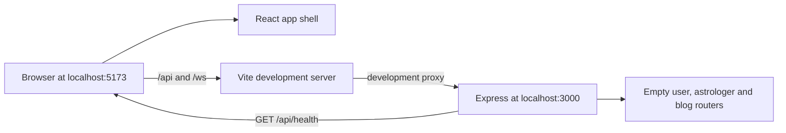

# Architecture

How the app is put together, as built. For what it should do, see [README.md](../README.md).

Last updated: 2026-09-30

## Current state

Step 1 provides a runnable development foundation (README §1, §3 and §10).

- `frontend/` is a React single-page app with a four-tab user shell, route placeholders and shared components. `frontend/src/design.css` is the only app stylesheet.
- `backend/` is an Express server listening on `PORT` or 3000. HTTP routes are mounted at `/api`; only the public health endpoint has a real handler so far.
- Vite forwards `/api` and `/ws` to the backend in development so the browser uses one origin.
- The early Prisma schema and WebSocket stubs still exist but were not changed in Step 1.

## Overview



Production hosting is not built yet. README §1 requires the frontend, API and WebSocket endpoint to use one HTTPS domain.

## Folder structure

```text
backend/
  index.ts                  Express setup, health route and server listener
  routes/                   Mounted route modules; handlers come in later steps
  src/prisma/               Early Prisma contract and database client
  src/realtime/             Existing stubs reserved for Step 10
frontend/
  src/App.tsx               Route map, placeholders and user app shell
  src/components/           Shared UI components
  src/screens/DesignPage.tsx Development-only component and motion gallery
  src/design.css             Tokens, base styles, components and animation
  src/main.tsx               Fonts, global CSS, router and React root
  vite.config.ts             Development proxy for /api and /ws
docs/
  features/                 Per-step implementation records
```

## Key libraries

| Library | Used for | Added in step |
|---|---|---|
| React 19 and React DOM | Frontend component rendering | Boilerplate |
| Vite 8 | Frontend development server and production bundling | Boilerplate |
| React Router | Client-side routes and active bottom tabs | 1 |
| `@fontsource/nunito` | Self-hosted Nunito font files | 1 |
| Express 5 | Backend HTTP server and routers | Boilerplate |
| `cors` | Credentialed allow-origin response headers | Boilerplate; moved to runtime dependencies in 1 |
| `dotenv` | Load backend environment variables | Boilerplate; applied at server entry in 1 |
| `tsx` | Watch and run backend TypeScript in development | 1 |
| TypeScript | Backend type-checking and frontend compilation | Direct backend dependency added in 1 |
| Vitest | Backend test runner; Step 1 has no test files | 1 |
| Prisma 8 packages | Early database client and contract tooling | Boilerplate; schema rebuild is Step 2 |
| `ws` | Existing WebSocket stubs | Boilerplate; implementation is Step 10 |

## External services

| Service | Used for | Env vars | Added in step |
|---|---|---|---|
| None connected yet | Step 1 uses only local frontend and backend processes | — | — |

## Main flows

Describe each flow once it's built, with a sequence diagram where it helps. Link each row to its section below.

| Flow | Built in steps | Section |
|---|---|---|
| Development request routing | 1 | [Overview](#overview) |
| Owner and astrologer login | 3, 4 | — |
| User sign-in with Google | 6 | — |
| Time slots and booking holds | 7, 8 | — |
| In-app call (WebSocket signalling, WebRTC, TURN) | 10, 11 | — |
| Payments (Razorpay orders, verification, webhooks, refunds) | 12, 13 | — |
| Blogs | 14 | — |
| Install and offline support (service worker) | 15 | — |

## Differences from the spec

None in Step 1. Future routes exist only as clearly labelled placeholders.
