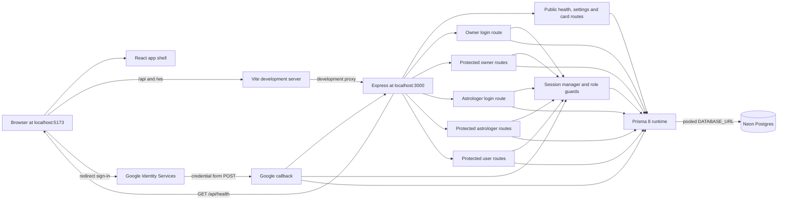
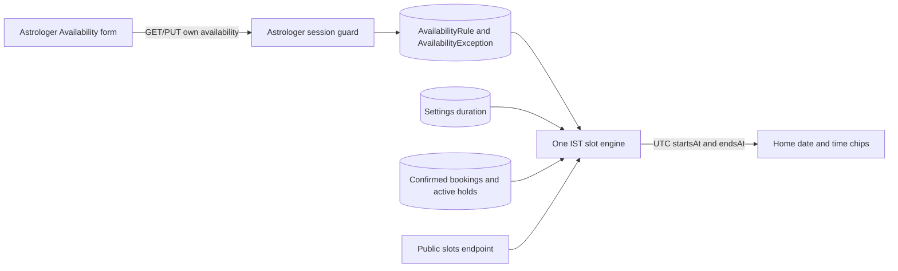
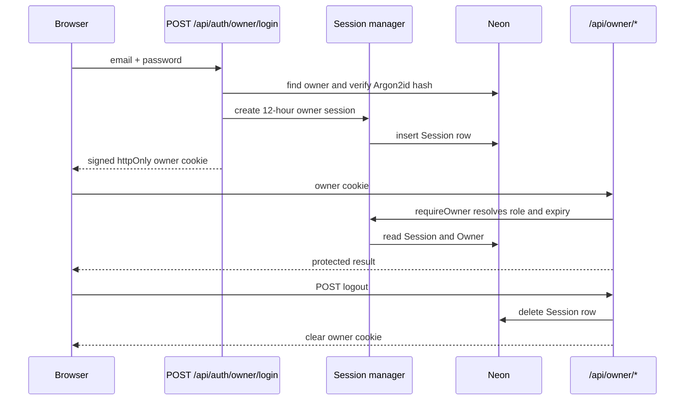

# Architecture

How the app is put together, as built. For what it should do, see [README.md](../README.md).

Last updated: 2026-10-01

## Current state

Step 7 adds authenticated astrologer availability, one settings-backed IST slot engine, the public 14-day slots endpoint and Home date/time selection (README §4, §6.1–§6.3 and §8.3). The current contract remains applied and verified on Neon; this step needs no migration.

- `frontend/` is a React single-page app with public Home through time selection, Google sign-in gates, user details and Settings, a four-tab user shell, protected owner and astrologer profile/availability workflows, and later-step placeholders. `frontend/src/design.css` is the only app stylesheet.
- `backend/` separates `app.ts` from the `index.ts` listener so routers can be tested without opening a port. HTTP routes are mounted at `/api`; public data/slots, all three role sessions, user self-service, owner management and astrologer authentication/profile/availability APIs are implemented.
- `backend/src/prisma/contract.prisma` defines the 13 application tables. The running app and seed use the pooled `DATABASE_URL`; Prisma migration commands use `DIRECT_DATABASE_URL`.
- Prisma 8 timestamps use native PostgreSQL `timestamptz`, `date` and `time` columns. A Temporal polyfill supplies the required runtime types on Node.js 24.
- Vite forwards `/api` and `/ws` to the backend in development so the browser uses one origin.
- The existing WebSocket stubs remain unchanged until Step 10.

## Overview



Production hosting is not built yet. README §1 requires the frontend, API and WebSocket endpoint to use one HTTPS domain.

## Folder structure

```text
backend/
  app.ts                    Express setup, CORS and router mounting
  index.ts                  Environment loading and HTTP listener
  routes/Public.ts          Public database health and settings handlers
  routes/Astrologers.ts     Public privacy-limited Home-card handler
  routes/UserAuth.ts        Google redirect callback and user-session creation
  routes/User.ts            Protected self-only user details and logout
  routes/OwnerAuth.ts       Owner credential login
  routes/Owner.ts           Protected owner account and settings handlers
  routes/AstrologerAuth.ts  Astrologer credential login
  routes/Astrologer.ts      Protected astrologer session, profile and availability handlers
  src/availability/         Availability validation/storage and the shared slot engine
  src/astrologer/           Astrologer validation and database service
  src/auth/                 Session cookies, role guards and login throttling
  src/http/                 Shared Zod response helper
  src/owner/                Owner validation schemas and database service
  src/public/               Public Home-card database service
  src/user/                 Google verification, user validation and database service
  src/prisma/               Contract, generated artifacts, runtime client and seed
  migrations/               Prisma 8 migration graph, snapshots and compiled operations
  src/realtime/             Existing stubs reserved for Step 10
frontend/
  src/App.tsx               Route map, placeholders and user app shell
  src/api/owner.ts          Typed owner API client and money conversion
  src/api/astrologer.ts     Typed astrologer API client
  src/api/public.ts         Typed public card and settings client
  src/api/user.ts           Typed user account/details/logout client
  src/components/           Shared UI components
  src/components/AvailabilityEditor.tsx Protected weekly and exception editor
  src/screens/DesignPage.tsx Development-only component and motion gallery
  src/screens/OwnerPage.tsx  Owner login and management interface
  src/screens/AstrologerPage.tsx Astrologer login and profile interface
  src/screens/HomePage.tsx   Public Home list and call-type picker
  src/screens/HistoryPage.tsx User-session gate and Step 9 signed-in placeholder
  src/screens/SettingsPage.tsx User profile, editable details, policies and logout
  src/user-details.ts       Shared browser-side detail validation and form shaping
  src/design.css             Tokens, base styles, components and animation
  src/main.tsx               Fonts, global CSS, router and React root
  vite.config.ts             Development proxy for /api and /ws
docs/
  features/                 Per-step implementation records
```

## Key libraries

| Library | Used for | Added in step |
|---|---|---|
| React 19 and React DOM | Frontend component rendering | Boilerplate |
| Vite 8 | Frontend development server and production bundling | Boilerplate |
| React Router | Client-side routes and active bottom tabs | 1 |
| `@fontsource/nunito` | Self-hosted Nunito font files | 1 |
| Express 5 | Backend HTTP server and routers | Boilerplate |
| `cors` | Credentialed allow-origin response headers | Boilerplate; moved to runtime dependencies in 1 |
| `dotenv` | Load backend environment variables | Boilerplate; applied at server entry in 1 |
| `tsx` | Watch and run backend TypeScript in development | 1 |
| TypeScript | Backend type-checking and frontend compilation | Direct backend dependency added in 1 |
| Vitest | Backend tests plus frontend component regression tests | 1; frontend use added after 3 |
| Prisma 8 packages | Contract emission, migration tooling and PostgreSQL runtime | Boilerplate; upgraded and completed in 2 |
| `argon2` | Argon2id hash for the seeded owner password | 2 |
| `google-auth-library` | Verify Google ID-token signatures, audience, issuer and expiry on the backend | 6 |
| `temporal-polyfill` | Temporal values for Prisma 8 on Node.js 24 | 2 |
| `zod` | Strict protected and public request validation | 3 |
| `supertest` and `@types/supertest` | HTTP authorization, privacy-boundary and route tests | 3 (development only) |
| Testing Library, user-event and jsdom | Frontend component interaction tests in a browser-like DOM | After 3 (development only) |
| `ws` | Existing WebSocket stubs | Boilerplate; implementation is Step 10 |

## External services

| Service | Used for | Env vars | Added in step |
|---|---|---|---|
| Neon Postgres | Application data, settings, owner seed, profiles, availability, booking conflict reads, user details and server sessions | `DATABASE_URL`, `DIRECT_DATABASE_URL` | 2; live use expanded in 3–7 |
| Google Identity Services | Redirect-mode user identity and verified Google account claims | `GOOGLE_CLIENT_ID`, `VITE_GOOGLE_CLIENT_ID` | 6 |

## Main flows

Describe each flow once it's built, with a sequence diagram where it helps. Link each row to its section below.

| Flow | Built in steps | Section |
|---|---|---|
| Development request routing | 1 | [Overview](#overview) |
| Public database health, settings and Home cards | 2, 5 | [Public Home flow](#public-home-flow) |
| Owner and astrologer login | 3, 4 | [Panel session flows](#panel-session-flows) |
| User sign-in with Google and own details | 6 | [User sign-in and details flow](#user-sign-in-and-details-flow) |
| Availability and time slots | 7 | [Availability and slot flow](#availability-and-slot-flow) |
| Booking creation and holds | 8 | — |
| In-app call (WebSocket signalling, WebRTC, TURN) | 10, 11 | — |
| Payments (Razorpay orders, verification, webhooks, refunds) | 12, 13 | — |
| Blogs | 14 | — |
| Install and offline support (service worker) | 15 | — |

## Public Home flow

On mount, Home requests `GET /api/astrologers` and `GET /api/settings/public` independently. The card service filters `Astrologer` by `isActive = true`, `isListed = true` and non-null `profileSavedAt`, selects only card fields, and orders by display name. The route then rebuilds each response object from those public fields before serialization.

Settings stay separate from card data. A settings failure leaves browsing intact and appears only inside the call-type sheet. Selecting a call type checks the user session, collects missing details and a phone number when required, loads 14 days of free slots, then stops after the user chooses a time.

## Availability and slot flow



The availability save replaces only the signed-in astrologer's rules and exceptions in one transaction. Weekly ranges form the base schedule; extra exception windows are merged in and blocked ranges are subtracted. The transaction reads confirmed future bookings only to count warnings and never changes a Booking row.

The public service requires an active, listed, profile-saved astrologer, reads the current duration for the requested call type, and loads only exceptions and booking intervals that can affect the 14-date range. `calculateAvailableSlots` is clock-injected for deterministic tests. It interprets local availability in `Asia/Kolkata`, emits UTC instants, ignores expired holds and leaves today empty for Normal. Home displays those instants in IST and does not send a price or create a booking.

## User sign-in and details flow

```mermaid
sequenceDiagram
    participant Browser
    participant Google as Google Identity Services
    participant Callback as POST /api/auth/google
    participant Sessions as Session manager
    participant UserAPI as GET/PUT /api/me
    participant Neon

    Browser->>Google: redirect mode + local continuation state
    Google->>Callback: credential + body CSRF + state
    Callback->>Callback: match CSRF cookie; verify token and email
    Callback->>Neon: find or create User by googleSub
    Callback->>Sessions: create 30-day user session
    Callback-->>Browser: httpOnly cookie + 303 continuation
    Browser->>UserAPI: root-path user cookie
    UserAPI->>Sessions: requireUser resolves role and expiry
    UserAPI->>Neon: read or replace session subject's details
    UserAPI-->>Browser: own user only
```

The GIS button uses `ux_mode: "redirect"`, posts to same-origin `/api/auth/google`, and sends a local route in its button `state`. The callback accepts that value only when it resolves to `APP_ORIGIN`, preventing an external redirect. Home includes only astrologer id and call type in that route; no personal data is placed in the URL.

New users are created immediately after verified Google sign-in so later blog interactions can require login without requiring birth details. The details completeness flag requires name, birth date, local birth time, place and gender. Phone remains optional for Normal but the Home flow requires and saves it for Urgent and Subscription.

## Panel session flows



Astrologer login follows the same session-manager flow through `POST /api/auth/astrologer/login`. `requireAstrologer` also checks that the session subject is the active astrologer record. A temporary-password account can reach session, logout and password-replacement actions; the service rejects profile reads and saves until `mustChangePassword` is false.

Replacing a temporary password deletes all of that astrologer's sessions inside the password-update transaction, then creates one fresh session for the current browser. Owner deactivation and password reset also delete every session for that astrologer in the same transaction as the account change.

Cookie configurations for user, astrologer and owner roles live together with separate names. User and astrologer cookies use path `/` so shared APIs and `/ws` receive them; the owner cookie remains scoped to `/api/owner`. User sessions last 30 days; panel sessions last 12 hours.

The login limiter is held in the backend process. It is correct for the current single-process development setup. A multi-instance production topology needs a shared rate-limit store in Step 16.

## Differences from the spec

None in Step 7. Booking creation remains clearly labelled Step 8 work.
