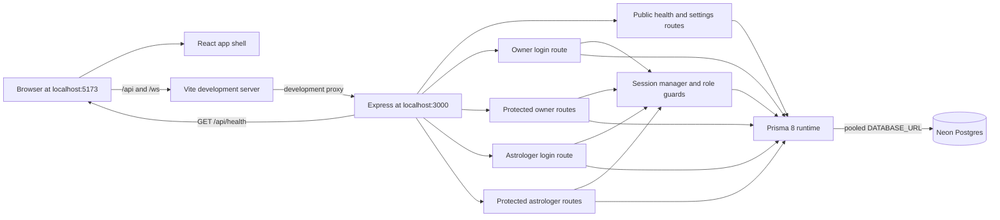
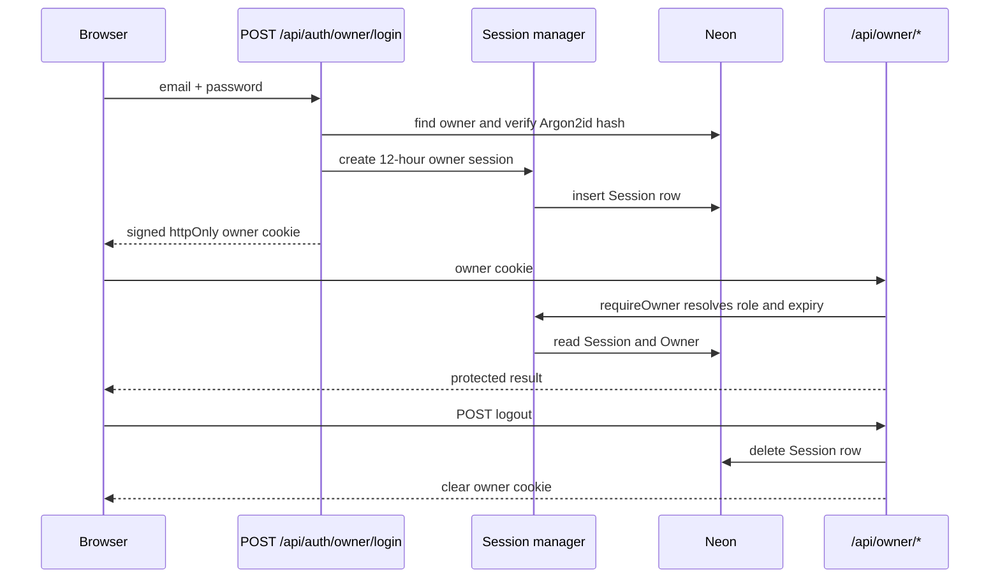

# Architecture

How the app is put together, as built. For what it should do, see [README.md](../README.md).

Last updated: 2026-10-01

## Current state

Step 4 adds astrologer authentication, forced password replacement, own-profile editing and a reusable Home card (README §2, §5.1, §5.6, §8.1, §8.2, §9 and §12). The current contract, including the first-profile-save marker, is applied and verified on Neon.

- `frontend/` is a React single-page app with a four-tab user shell, protected owner and astrologer workflows, and later-step placeholders. `frontend/src/design.css` is the only app stylesheet.
- `backend/` separates `app.ts` from the `index.ts` listener so routers can be tested without opening a port. HTTP routes are mounted at `/api`; public health/settings, owner management and astrologer authentication/profile APIs are implemented.
- `backend/src/prisma/contract.prisma` defines the 13 application tables. The running app and seed use the pooled `DATABASE_URL`; Prisma migration commands use `DIRECT_DATABASE_URL`.
- Prisma 8 timestamps use native PostgreSQL `timestamptz`, `date` and `time` columns. A Temporal polyfill supplies the required runtime types on Node.js 24.
- Vite forwards `/api` and `/ws` to the backend in development so the browser uses one origin.
- The existing WebSocket stubs remain unchanged until Step 10.

## Overview



Production hosting is not built yet. README §1 requires the frontend, API and WebSocket endpoint to use one HTTPS domain.

## Folder structure

```text
backend/
  app.ts                    Express setup, CORS and router mounting
  index.ts                  Environment loading and HTTP listener
  routes/Public.ts          Public database health and settings handlers
  routes/OwnerAuth.ts       Owner credential login
  routes/Owner.ts           Protected owner account and settings handlers
  routes/AstrologerAuth.ts  Astrologer credential login
  routes/Astrologer.ts      Protected astrologer session and profile handlers
  src/astrologer/           Astrologer validation and database service
  src/auth/                 Session cookies, role guards and login throttling
  src/http/                 Shared Zod response helper
  src/owner/                Owner validation schemas and database service
  src/prisma/               Contract, generated artifacts, runtime client and seed
  migrations/               Prisma 8 migration graph, snapshots and compiled operations
  src/realtime/             Existing stubs reserved for Step 10
frontend/
  src/App.tsx               Route map, placeholders and user app shell
  src/api/owner.ts          Typed owner API client and money conversion
  src/api/astrologer.ts     Typed astrologer API client
  src/components/           Shared UI components
  src/screens/DesignPage.tsx Development-only component and motion gallery
  src/screens/OwnerPage.tsx  Owner login and management interface
  src/screens/AstrologerPage.tsx Astrologer login and profile interface
  src/design.css             Tokens, base styles, components and animation
  src/main.tsx               Fonts, global CSS, router and React root
  vite.config.ts             Development proxy for /api and /ws
docs/
  features/                 Per-step implementation records
```

## Key libraries

| Library | Used for | Added in step |
|---|---|---|
| React 19 and React DOM | Frontend component rendering | Boilerplate |
| Vite 8 | Frontend development server and production bundling | Boilerplate |
| React Router | Client-side routes and active bottom tabs | 1 |
| `@fontsource/nunito` | Self-hosted Nunito font files | 1 |
| Express 5 | Backend HTTP server and routers | Boilerplate |
| `cors` | Credentialed allow-origin response headers | Boilerplate; moved to runtime dependencies in 1 |
| `dotenv` | Load backend environment variables | Boilerplate; applied at server entry in 1 |
| `tsx` | Watch and run backend TypeScript in development | 1 |
| TypeScript | Backend type-checking and frontend compilation | Direct backend dependency added in 1 |
| Vitest | Backend tests plus frontend component regression tests | 1; frontend use added after 3 |
| Prisma 8 packages | Contract emission, migration tooling and PostgreSQL runtime | Boilerplate; upgraded and completed in 2 |
| `argon2` | Argon2id hash for the seeded owner password | 2 |
| `temporal-polyfill` | Temporal values for Prisma 8 on Node.js 24 | 2 |
| `zod` | Strict owner and astrologer request validation | 3 |
| `supertest` and `@types/supertest` | HTTP authorization and owner-route tests | 3 (development only) |
| Testing Library, user-event and jsdom | Frontend component interaction tests in a browser-like DOM | After 3 (development only) |
| `ws` | Existing WebSocket stubs | Boilerplate; implementation is Step 10 |

## External services

| Service | Used for | Env vars | Added in step |
|---|---|---|---|
| Neon Postgres | Application data, settings, owner seed, profiles and server sessions | `DATABASE_URL`, `DIRECT_DATABASE_URL` | 2; live use expanded in 3 and 4 |

## Main flows

Describe each flow once it's built, with a sequence diagram where it helps. Link each row to its section below.

| Flow | Built in steps | Section |
|---|---|---|
| Development request routing | 1 | [Overview](#overview) |
| Public database health and settings | 2 | [Overview](#overview) |
| Owner and astrologer login | 3, 4 | [Panel session flows](#panel-session-flows) |
| User sign-in with Google | 6 | — |
| Time slots and booking holds | 7, 8 | — |
| In-app call (WebSocket signalling, WebRTC, TURN) | 10, 11 | — |
| Payments (Razorpay orders, verification, webhooks, refunds) | 12, 13 | — |
| Blogs | 14 | — |
| Install and offline support (service worker) | 15 | — |

## Panel session flows



Astrologer login follows the same session-manager flow through `POST /api/auth/astrologer/login`. `requireAstrologer` also checks that the session subject is the active astrologer record. A temporary-password account can reach session, logout and password-replacement actions; the service rejects profile reads and saves until `mustChangePassword` is false.

Replacing a temporary password deletes all of that astrologer's sessions inside the password-update transaction, then creates one fresh session for the current browser. Owner deactivation and password reset also delete every session for that astrologer in the same transaction as the account change.

Cookie configurations for user, astrologer and owner roles live together with separate names. User and astrologer cookies use path `/` so future shared APIs and `/ws` can receive them; the owner cookie remains scoped to `/api/owner`.

The login limiter is held in the backend process. It is correct for the current single-process development setup. A multi-instance production topology needs a shared rate-limit store in Step 16.

## Differences from the spec

None in Step 4. Availability, bookings, blogs and public Home data remain clearly labelled later-step work.
