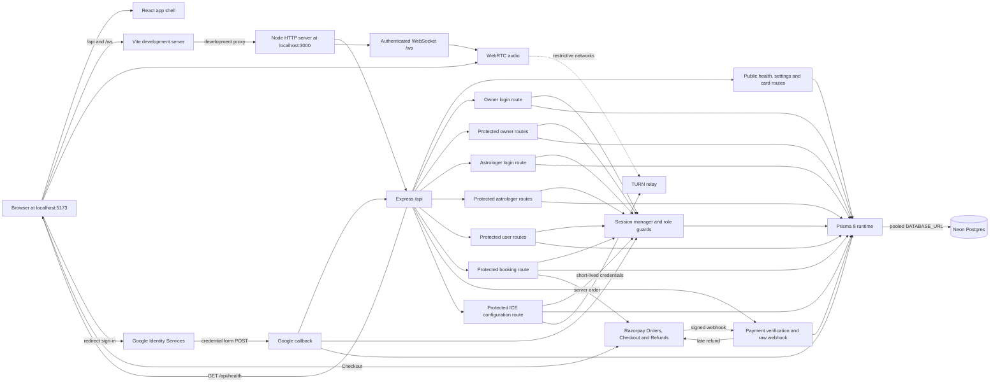
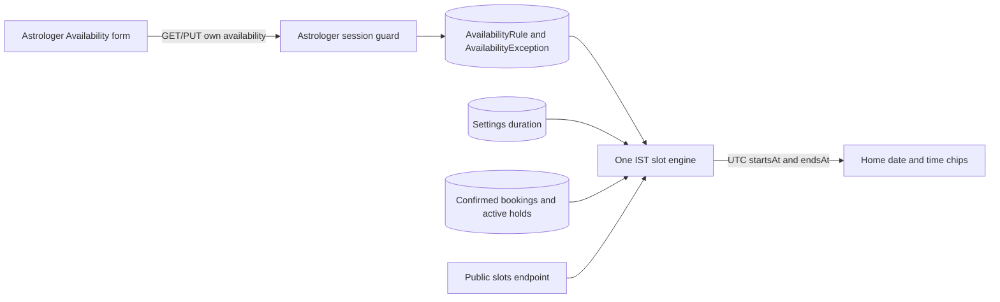
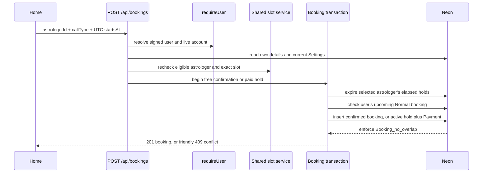
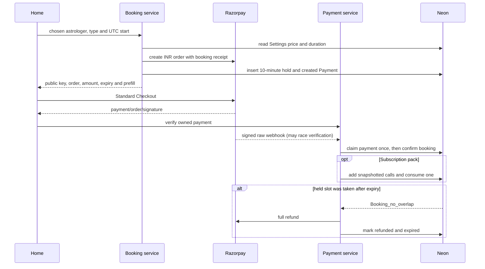
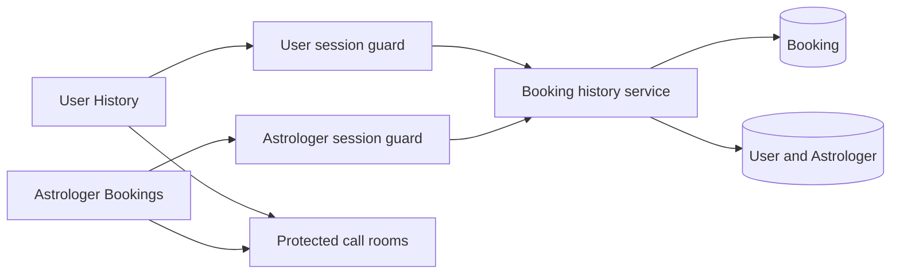
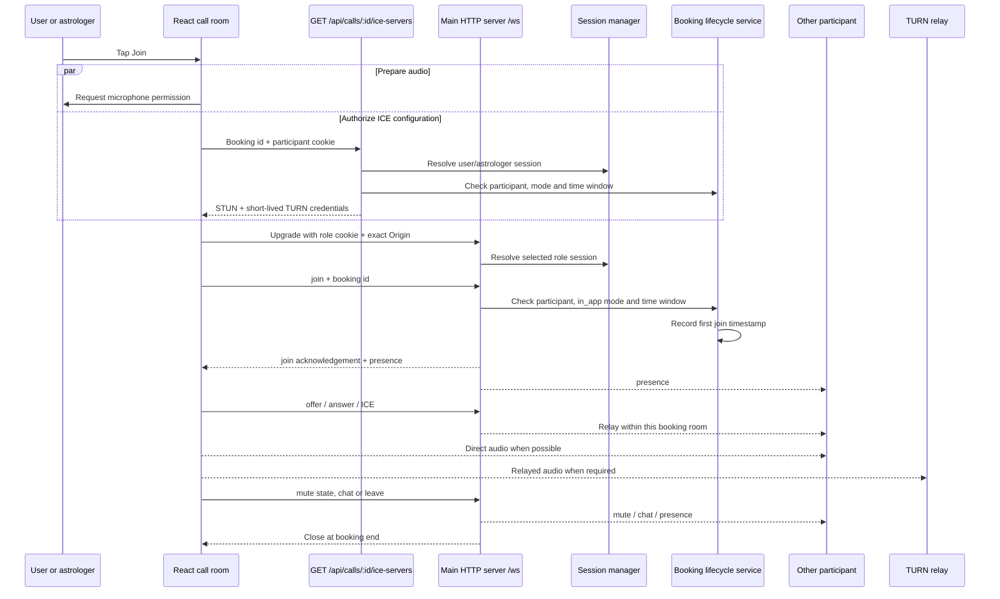
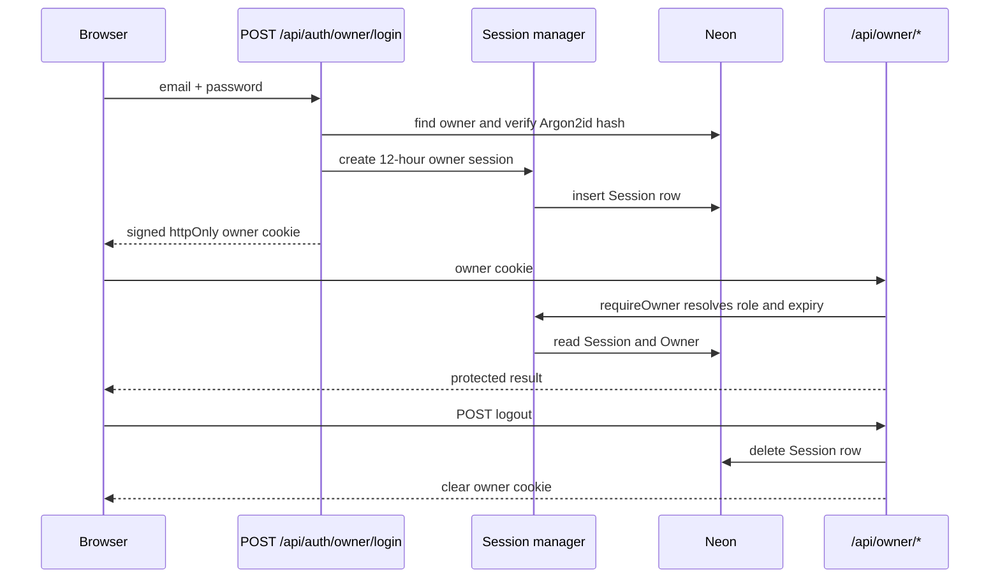

# Architecture

How the app is put together, as built. For what it should do, see [README.md](../README.md).

Last updated: 2026-10-02

## Current state

Step 15 makes the frontend installable and replaces the policy placeholders (README §3, §5.7 and §17). The production build emits a manifest and an auto-updating app-shell service worker; public policy pages include live Settings-backed pricing.

- `frontend/` is an installable React single-page app with public Home, Blogs and policy pages, Normal/Urgent/Subscription booking, History, Settings, authenticated Normal-call rooms, and protected owner and astrologer workflows. Blog reading is public; liking and commenting use the existing Google sign-in without requiring booking details. `frontend/src/design.css` is the only app stylesheet.
- `backend/` separates `app.ts` from the main HTTP/WebSocket listener so HTTP routers can be tested without opening a port. HTTP routes are mounted at `/api`; the authenticated WebSocket endpoint is attached at `/ws` on that same server.
- `backend/src/prisma/contract.prisma` defines the 13 application tables. The running app and seed use the pooled `DATABASE_URL`; Prisma migration commands use `DIRECT_DATABASE_URL`.
- Prisma 8 timestamps use native PostgreSQL `timestamptz`, `date` and `time` columns. A Temporal polyfill supplies the required runtime types on Node.js 24.
- Vite forwards `/api` and `/ws` to the backend in development so the browser uses one origin.
- The Vite production build generates the web manifest and auto-updating Workbox service worker. It precaches only the app shell and denies API, WebSocket, call-room and payment paths from its navigation fallback.
- WebSocket rooms are keyed by booking id. They relay validated WebRTC signalling, transient chat and live presence/mute state only between the booked user and astrologer during the stored call window. The room timer closes both sockets at the booking end.

## Overview



Production hosting is not built yet. README §1 requires the frontend, API and WebSocket endpoint to use one HTTPS domain; install prompts and service workers also require HTTPS outside localhost.

## Folder structure

```text
backend/
  app.ts                    Express setup, raw Razorpay webhook, JSON, CORS and router mounting
  index.ts                  Environment loading and shared HTTP/WebSocket listener
  routes/Public.ts          Public database health and settings handlers
  routes/Astrologers.ts     Public privacy-limited Home-card handler
  routes/UserAuth.ts        Google redirect callback and user-session creation
  routes/User.ts            Protected self-only user details, booking history and logout
  routes/Bookings.ts        Protected free confirmation or paid hold/order creation
  routes/Payments.ts        Protected verification and public signed webhook handlers
  routes/Calls.ts           Protected booking-scoped ICE server configuration
  routes/OwnerAuth.ts       Owner credential login
  routes/Owner.ts           Protected owner account and settings handlers
  routes/AstrologerAuth.ts  Astrologer credential login
  routes/Astrologer.ts      Protected astrologer session, profile, availability and booking handlers
  routes/Blogs.ts           Public published posts and protected user likes/comments
  src/availability/         Availability validation/storage and the shared slot engine
  src/astrologer/           Astrologer validation and database service
  src/auth/                 Session cookies, role guards and login throttling
  src/booking/              Booking input validation and transactional service
  src/booking-history/      Subject-scoped booking reads and response shaping
  src/blog/                 Blog validation, persistence, response shaping and comment throttling
  src/dev/                  Production-blocked development data helper
  src/http/                 Shared Zod response helper
  src/owner/                Owner validation schemas and database service
  src/payment/              Razorpay gateway, signatures and idempotent settlement/refund service
  src/public/               Public Home-card database service
  src/user/                 Google verification, user validation and database service
  src/prisma/               Contract, generated artifacts, runtime client and seed
  migrations/               Prisma 8 migration graph, snapshots and compiled operations
  src/realtime/             Upgrade authentication, room/chat protocol, booking lifecycle and TURN credentials
frontend/
  public/                    Source SVG plus generated install icons
  src/App.tsx               Route map, connectivity state and user app shell
  src/call/                  WebSocket protocol, WebRTC negotiation, timer and speaking analysis
  src/api/calls.ts           Typed booking-scoped ICE server client
  src/api/owner.ts          Typed owner API client and money conversion
  src/api/astrologer.ts     Typed astrologer API client
  src/api/public.ts         Typed public card and settings client
  src/api/user.ts           Typed user account/details/logout client
  src/api/bookings.ts       Typed booking-creation client
  src/api/booking-history.ts Shared booking-card response types
  src/api/blogs.ts          Public reading and signed-in reaction client
  src/components/           Shared UI components
  src/components/InstallPrompt.tsx Home installation banner and iOS Safari hint
  src/components/PolicyLinks.tsx Shared seven-route policy navigation
  src/components/AvailabilityEditor.tsx Protected weekly and exception editor
  src/screens/DesignPage.tsx Development-only component and motion gallery
  src/screens/OwnerPage.tsx  Owner login and management interface
  src/screens/AstrologerPage.tsx Astrologer login, profile, availability and bookings interface
  src/screens/HomePage.tsx   Public Home list and call-type picker
  src/screens/HistoryPage.tsx Private user booking history
  src/screens/BlogsPage.tsx Public paged blog list
  src/screens/BlogPostPage.tsx Public post, like and comment interface
  src/screens/CallRoomPage.tsx Authenticated user/astrologer call-room states and controls
  src/screens/SettingsPage.tsx User profile, editable details, policies and logout
  src/screens/PolicyPage.tsx Public policy content and Settings-backed pricing
  src/razorpay-checkout.ts  On-demand Standard Checkout loader and browser outcome adapter
  src/user-details.ts       Shared browser-side detail validation and form shaping
  src/design.css             Tokens, base styles, components and animation
  src/main.tsx               Fonts, global CSS, router and React root
  pwa-assets.config.ts       Reproducible PNG generation from the source SVG
  vite.config.ts             Development proxy plus manifest/service-worker build
docs/
  features/                 Per-step implementation records
```

## Key libraries

| Library | Used for | Added in step |
|---|---|---|
| React 19 and React DOM | Frontend component rendering | Boilerplate |
| Vite 8 | Frontend development server and production bundling | Boilerplate |
| React Router | Client-side routes and active bottom tabs | 1 |
| `@fontsource/nunito` | Self-hosted Nunito font files | 1 |
| Express 5 | Backend HTTP server and routers | Boilerplate |
| `cors` | Credentialed allow-origin response headers | Boilerplate; moved to runtime dependencies in 1 |
| `dotenv` | Load backend environment variables | Boilerplate; applied at server entry in 1 |
| `tsx` | Watch and run backend TypeScript in development | 1 |
| TypeScript | Backend type-checking and frontend compilation | Direct backend dependency added in 1 |
| Vitest | Backend tests plus frontend component regression tests | 1; frontend use added after 3 |
| Prisma 8 packages | Contract emission, migration tooling and PostgreSQL runtime | Boilerplate; upgraded and completed in 2 |
| `argon2` | Argon2id hash for the seeded owner password | 2 |
| `google-auth-library` | Verify Google ID-token signatures, audience, issuer and expiry on the backend | 6 |
| `temporal-polyfill` | Temporal values for Prisma 8 on Node.js 24 | 2 |
| `zod` | Strict protected and public request validation | 3 |
| `supertest` and `@types/supertest` | HTTP authorization, privacy-boundary and route tests | 3 (development only) |
| Testing Library, user-event and jsdom | Frontend component interaction tests in a browser-like DOM | After 3 (development only) |
| `ws` | Authenticated upgrade handling and booking-room signalling | Boilerplate; implemented in 10 |
| `razorpay` | Official server-side order creation, payment lookup and refunds | 12 |
| `vite-plugin-pwa` | Generate/register the manifest and auto-updating Workbox service worker | 15 (development only) |
| `@vite-pwa/assets-generator` | Generate install PNGs from the one source SVG | 15 (development only) |

## External services

| Service | Used for | Env vars | Added in step |
|---|---|---|---|
| Neon Postgres | Application data, settings, owner seed, profiles, availability, bookings, user details and server sessions | `DATABASE_URL`, `DIRECT_DATABASE_URL` | 2; live use expanded in 3–9 |
| Google Identity Services | Redirect-mode user identity and verified Google account claims | `GOOGLE_CLIENT_ID`, `VITE_GOOGLE_CLIENT_ID` | 6 |
| Google public STUN | WebRTC host/server-reflexive ICE candidates; no account or secret | None | 10 |
| coturn or compatible TURN service | Relayed WebRTC audio on restrictive and mobile networks | `TURN_URLS`, `TURN_SECRET` | 11 |
| Razorpay | INR Orders API, Standard Checkout, signed webhooks and full late-payment refunds | `RAZORPAY_KEY_ID`, `RAZORPAY_KEY_SECRET`, `RAZORPAY_WEBHOOK_SECRET` | 12 |

## Main flows

Describe each flow once it's built, with a sequence diagram where it helps. Link each row to its section below.

| Flow | Built in steps | Section |
|---|---|---|
| Development request routing | 1 | [Overview](#overview) |
| Public database health, settings and Home cards | 2, 5 | [Public Home flow](#public-home-flow) |
| Owner and astrologer login | 3, 4 | [Panel session flows](#panel-session-flows) |
| User sign-in with Google and own details | 6 | [User sign-in and details flow](#user-sign-in-and-details-flow) |
| Availability and time slots | 7 | [Availability and slot flow](#availability-and-slot-flow) |
| Zero-price booking creation | 8 | [Booking creation flow](#booking-creation-flow) |
| Private booking history | 9 | [Booking history flow](#booking-history-flow) |
| In-app call (WebSocket signalling, WebRTC, TURN) | 10, 11 | [In-app call flow](#in-app-call-flow) |
| Urgent payment (Razorpay orders, verification, webhooks, refunds) | 12 | [Paid booking flow](#paid-booking-flow) |
| Blogs | 14 | [Blog flow](#blog-flow) |
| Install, offline and public policies | 15 | [Install, offline and policy flow](#install-offline-and-policy-flow) |

## Public Home flow

On mount, Home requests `GET /api/astrologers` and `GET /api/settings/public` independently. The card service filters `Astrologer` by `isActive = true`, `isListed = true` and non-null `profileSavedAt`, selects only card fields, and orders by display name. The route then rebuilds each response object from those public fields before serialization.

Settings stay separate from card data. A settings failure leaves browsing intact and appears only inside the call-type sheet. Selecting a call type checks the user session, collects missing details and a phone number when required, loads 14 days of free slots, then shows the chosen time in a summary. The browser sends only astrologer id, call type and UTC start to the protected booking endpoint.

## Install, offline and policy flow

`vite-plugin-pwa` runs only for a production build. It emits the README §5.7 manifest, registers an auto-updating generated service worker and precaches `index.html`, compiled JavaScript/CSS, local fonts, the manifest and install icons. There is no runtime caching strategy. The navigation fallback explicitly excludes `/api`, `/ws`, both call-room prefixes and paths containing payment, payments or Razorpay.

`InstallPrompt` listens for `beforeinstallprompt` while the Home shell is mounted. Supported Android/desktop browsers get a dismissible banner; iPhone/iPad Safari gets the one-time Share → Add to Home Screen hint. Dismissal flags contain no personal data and stay in local storage. Standalone display mode suppresses both prompts.

The React shell listens for browser online/offline events. With no connection it replaces the current route with the README offline message, then restores that route when the browser reports online. This is intentionally separate from API error states.

All seven policy routes are public React pages and share navigation from Home and Settings. `/pricing` reuses `GET /api/settings/public`; it never embeds prices or durations in the bundle. The remaining pages contain clearly labelled owner placeholders, and Shipping states that the service is delivered online or by phone with nothing shipped.

## Availability and slot flow



The availability save replaces only the signed-in astrologer's rules and exceptions in one transaction. Weekly ranges form the base schedule; extra exception windows are merged in and blocked ranges are subtracted. The transaction reads confirmed future bookings only to count warnings and never changes a Booking row.

The public service first requires an active, listed, profile-saved astrologer. It then starts its four independent reads—Settings durations, weekly hours, date exceptions and blocking bookings—together and waits for all of them. It loads only exceptions and booking intervals that can affect the 14-date range. `calculateAvailableSlots` is clock-injected for deterministic tests. It interprets local availability in `Asia/Kolkata`, emits UTC instants, ignores expired holds and leaves today empty for Normal. Home displays those instants in IST and never sends a price or duration.

## Booking creation flow



The service derives user id from the session and derives price, duration, call mode, end time and status on the server. Complete details are required; Urgent and Subscription also require the user's saved phone. It invokes the same slot service used by the picker so eligibility, the 14-day range, Normal-from-tomorrow and current booking conflicts are rechecked at confirmation time.

Every zero-price call type is confirmed immediately. Normal is always `in_app`; the phone call types are always `phone`. Positive-price Normal or Urgent creates a ten-minute `pending_payment` booking and linked created Payment after the backend creates the server-priced Razorpay order. For Subscription, a conditional database update consumes one available credit and confirms with `usedCredit=true`; if none remains, the service creates a ten-minute pack-payment hold whose Payment snapshots the current pack size. A zero-price pack adds its calls and consumes this booking in the same transaction. Prisma 8 normalizes PostgreSQL error `23P01` from `Booking_no_overlap` to `SqlQueryError.sqlState`; the mapper checks that property directly and through a transaction `cause` before returning the specified same-slot `409` response.

## Paid booking flow



Only the public Razorpay key id reaches the browser. The backend owns the amount, currency, receipt and order notes. Checkout is loaded on demand and receives the user's current name, Google email and canonical phone. Verification uses a timing-safe HMAC comparison plus stored user/booking/order ownership; webhook HMAC uses the untouched raw bytes before Express JSON parsing. `WebhookEvent.eventId` and unique provider ids provide database idempotency. A conditional `Payment` state change provides the cross-process winner for verification/webhook races; only that winner can add pack credits, consume the booked call and confirm the booking. An order-keyed queue also avoids duplicate work inside one process.

## Booking history flow



List and detail reads receive the authenticated subject id from the route guard. The repository includes that id in the Booking predicate, so a caller cannot select another account through a path or query value. User responses join only the astrologer's id and display name. Astrologer responses select the booked user's permitted details and do not select email.

The server splits all confirmed calls by their current end time. Normal derives Completed only when both join timestamps exist; phone calls become Phone call after the end. The browser keeps the UTC start/end and ended result, schedules updates at the next boundary, re-splits Upcoming/Past, and changes Normal Join to Join now without polling or a page refresh. Phone calls never have a room link: user cards show the call message/current number and astrologer cards expose that number as `tel:`. Direct user and astrologer call routes remain Normal-only and reload one subject-scoped booking before showing the room.

## In-app call flow



The role query selects which root-path session cookie to resolve; it does not grant access. The booking service compares that session subject with the stored booking participant, requires `callMode = in_app`, `status = confirmed`, and a current time from `startsAt` inclusive to `endsAt` exclusive. The ICE endpoint performs the same record/window authorization before deriving a coturn REST username ending at the booking's `endsAt` and a base64 HMAC-SHA1 credential from backend-only `TURN_SECRET`. The response is not cached.

The WebSocket server accepts text JSON up to 16 KiB, validates every inbound and outbound message with Zod, serializes each socket's input, and keeps only one live socket per role in a room. Chat is trimmed to 1–500 characters, limited to one accepted message per second per socket, sent only to the peer and never stored. The exact room-end timer closes both roles with code `4000`; a 30-second sweep also finalizes calls that have no active room.

The browser asks for the exact README §7.3 audio constraints and authorized ICE configuration only after Join. A user-side impolite peer and astrologer-side polite peer implement perfect negotiation; recreating the peer connection when presence changes supports simultaneous joins and later rejoining. Individual description and ICE rejections can belong to an ignored offer or an obsolete peer, so they do not drive user-visible failure state. The room shows the audio warning only when the current peer connection reports `failed` or remains unconnected for 15 seconds after the other participant appears, and clears it on `connected`. Local mute follows the live audio track, while each presence snapshot carries the other participant's current mute state across rejoins.

The connected React room updates its countdown once per second, shows the two-minute notice, and treats the server's end close as authoritative. `setSinkId` capability controls whether Speaker is rendered. A `devicechange` captures the new default microphone, preserves the track's mute state and calls `replaceTrack`; local and remote `AnalyserNode` monitors drive speaking rings. `VITE_FORCE_RELAY=true` changes ICE policy only in development so a configured relay can be proved without affecting production bundles.

## User sign-in and details flow

```mermaid
sequenceDiagram
    participant Browser
    participant Google as Google Identity Services
    participant Callback as POST /api/auth/google
    participant Sessions as Session manager
    participant UserAPI as GET/PUT /api/me
    participant Neon

    Browser->>Google: redirect mode + local continuation state
    Google->>Callback: credential + body CSRF + state
    Callback->>Callback: match CSRF cookie; verify token and email
    Callback->>Neon: find or create User by googleSub
    Callback->>Sessions: create 30-day user session
    Callback-->>Browser: httpOnly cookie + 303 continuation
    Browser->>UserAPI: root-path user cookie
    UserAPI->>Sessions: requireUser resolves role and expiry
    UserAPI->>Neon: read or replace session subject's details
    UserAPI-->>Browser: own user only
```

The GIS button uses `ux_mode: "redirect"`, posts to same-origin `/api/auth/google`, and sends a local route in its button `state`. The callback accepts that value only when it resolves to `APP_ORIGIN`, preventing an external redirect. Home includes only astrologer id and call type in that route; no personal data is placed in the URL.

New users are created immediately after verified Google sign-in so later blog interactions can require login without requiring birth details. The details completeness flag requires name, birth date, local birth time, place and gender. Phone remains optional for Normal but the Home flow requires and saves it for Urgent and Subscription.

## Panel session flows



Astrologer login follows the same session-manager flow through `POST /api/auth/astrologer/login`. `requireAstrologer` also checks that the session subject is the active astrologer record. A temporary-password account can reach session, logout and password-replacement actions; a router gate rejects profile, availability and booking access until `mustChangePassword` is false.

Replacing a temporary password deletes all of that astrologer's sessions inside the password-update transaction, then creates one fresh session for the current browser. Owner deactivation and password reset also delete every session for that astrologer in the same transaction as the account change.

Cookie configurations for user, astrologer and owner roles live together with separate names. User and astrologer cookies use path `/` so shared APIs and `/ws` receive them; the owner cookie remains scoped to `/api/owner`. User sessions last 30 days; panel sessions last 12 hours.

The login limiter is held in the backend process. It is correct for the current single-process development setup. A multi-instance production topology needs a shared rate-limit store in Step 16.

## Blog flow

`GET /api/blogs` reads only published rows, orders them by publication time and returns 20 summaries plus a next-page marker. The detail route shapes author and commenter identities for public display and optionally marks the current user's like and deletable comments when a valid user cookie is present.

Likes use the `BlogLike` composite key, so one user can have at most one like per post. Comments are stored as plain text and returned oldest first. Protected mutations take the user or astrologer identity from the session: users delete only their own comments, astrologers mutate only their own posts and their posts' comments, and the owner can review the newest 50 comments. The browser renders every title, body and comment through React text nodes; no blog path accepts HTML.

## Differences from the spec

No Step 11 behavior differs from README §7.1–§7.3. Provider and real-device behavior still needs the manual TURN, mobile-data, Speaker and earbuds checks recorded in `docs/TESTING.md`.
